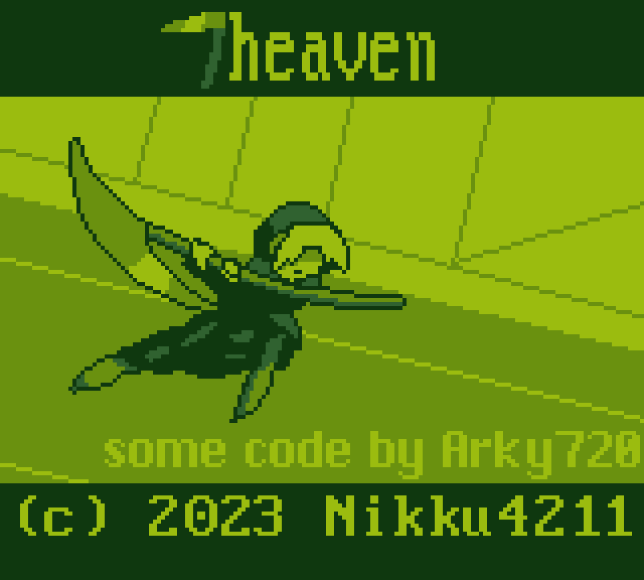
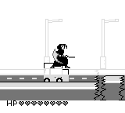

# 7heaven
Grim reaper Game Boy game for GBCompo23

# Build instructions

Run make -j(number of cores of your CPU multiplied by 2) twice. 

The game will not fully compile and it will error out on the first pass. That is normal.

Just run make -j(number of cores of your CPU multipled by 2) twice.
